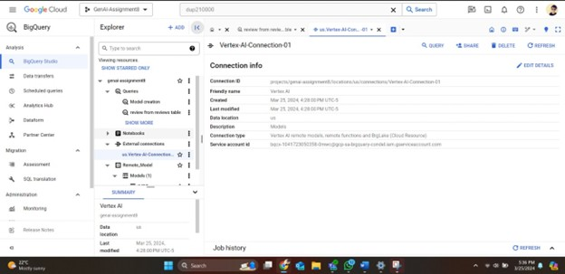
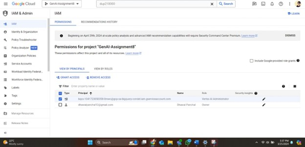
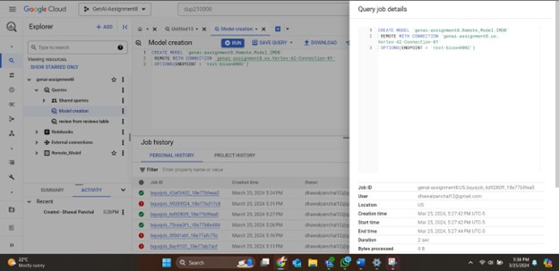
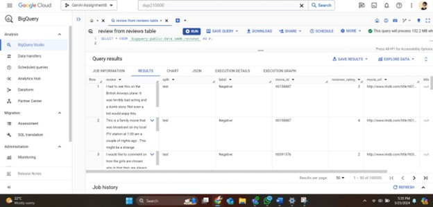
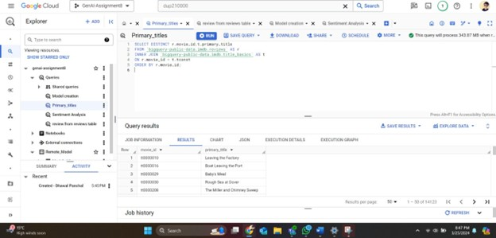
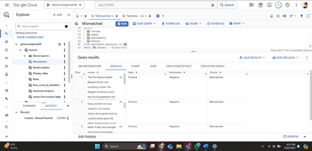
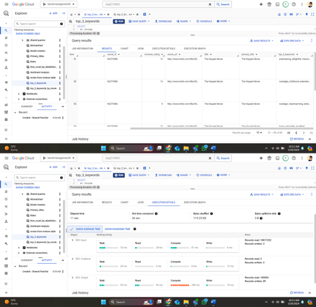
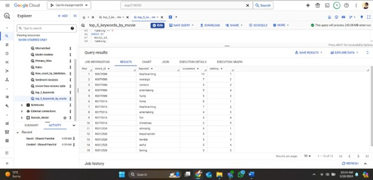

# BigQuery & Vertex AI: Conquer IMDB Reviews

This repository demonstrates the integration of **BigQuery** with **Vertex AI** to analyze IMDB reviews using a large language model (LLM). The project involves:

1. Setting up a Vertex AI connection in BigQuery.
2. Performing sentiment analysis on IMDB reviews.
3. Extracting keywords from the reviews.

---

## Part 1: Setup

### Steps:
1. **Create Vertex AI Connection in BigQuery:**
   - Set up the connection and configure necessary credentials.

   

2. **Grant Permissions:**
   - Assign the `Vertex AI User` role to the service account.

   

3. **Remote Model Configuration:**
   - Use the text-bison LLM to create a remote model for sentiment analysis and keyword extraction.

   

4. **Dataset:**
   - Leverage the `bigquery-public-data` IMDB dataset:
     - Reviews from the `reviews` table.
     - Movie titles from the `title_basics` table.

   

---

## Part 2: Sentiment Analysis

### Objectives:
1. Use the `ml.generate_text` function to perform sentiment analysis (positive/negative) on reviews for 3 specific movie IDs:
   - `tt0079588`
   - `tt0170016`
   - `tt0312528`

2. Return results in a table including:
   - Reviews columns.
   - Movie titles (`primary_title`).

   

3. Document settings and elapsed time:
   - Tokens.
   - Temperature.
   - `top_k` and `top_p` parameters.

4. Count sentiment labels and refine the prompt if unexpected values appear.

5. Calculate label/sentiment match rates:
   - Positive-label match rate.
   - Negative-label match rate.
   - Overall match rate.

   

6. Identify mismatched reviews and evaluate agreement with the LLM output.

---

## Part 3: Extract Keywords

### Objectives:
1. Use the `ml.generate_text` function to extract the top 3 keywords from reviews:
   - Convert plural keywords to singular form.
   - Exclude common words such as `movie`, `film`, `actor`, etc.

2. Return results in a table including:
   - Reviews columns.
   - Movie titles.

   

3. Document settings and elapsed time:
   - Tokens.
   - Temperature.
   - `top_k` and `top_p` parameters.

4. Identify the top 5 most repeated keywords per movie using `SPLIT/UNNEST`.

   

---

## Repository Structure

```plaintext
├── README.md            # Project overview and instructions
├── sql
│   ├── sentiment_analysis.sql     # Queries for sentiment analysis
│   ├── keyword_extraction.sql     # Queries for keyword extraction
├── scripts
│   ├── setup_vertex_ai.py         # Python script to configure Vertex AI
│   ├── query_execution.py         # Python script for automating query execution
├── results
│   ├── sentiment_results.csv      # Sample output of sentiment analysis
│   ├── keyword_results.csv        # Sample output of keyword extraction
├── docs
│   ├── setup_instructions.md      # Detailed setup guide for BigQuery and Vertex AI
├── images
│   ├── vertex_ai_connection.png   # Image for Vertex AI setup
│   ├── grant_permissions.png      # Image for permission granting
│   ├── remote_model.png           # Image for remote model configuration
│   ├── dataset_schema.png         # Image of dataset schema
│   ├── sentiment_analysis_results.png # Image of sentiment analysis results
│   ├── label_match_rates.png      # Image of label match rates
│   ├── keyword_extraction_results.png # Image of keyword extraction results
│   ├── top_keywords.png           # Image of top keywords
```

---
